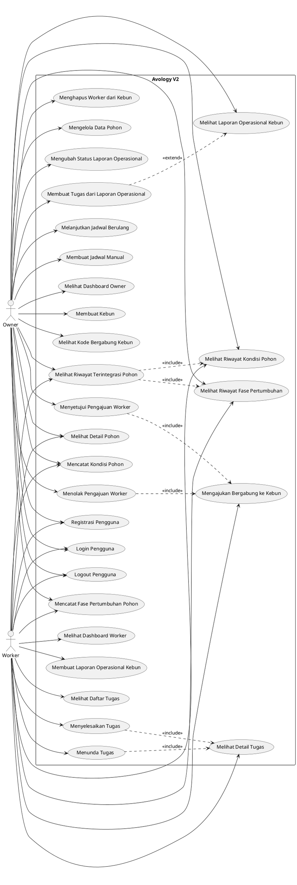

# Use Case Avology V2

> **Catatan perubahan (migrasi 046 & 047).** Fitur SOP perawatan dan target
> jadwal berupa **baris**/**kolom** sudah dicabut dari sistem. **UC-18**
> (Mengelola SOP Perawatan) dan **UC-20** (Membuat Jadwal dari SOP) dihapus
> beserta relasi `<<include>>`-nya di diagram; nomornya sengaja TIDAK dipakai
> ulang agar penomoran UC lain tidak bergeser. UC-19 dan UC-21 disunting isinya.
> Riwayat keputusannya ada di `decision-log.md`.

> **Catatan perubahan (migrasi 048–052).** **UC-09**, **UC-24**, dan **UC-25**
> disunting isinya. **UC-19** berubah judul menjadi "Melanjutkan Jadwal Berulang"
> karena sistem kini membuat jadwal penerus sendiri, dan aktornya bertambah
> Sistem. Tidak ada UC baru maupun UC yang dihapus. Riwayat keputusannya ada di
> `decision-log.md` (DL-034 sampai DL-038).

## 1. Tujuan Use Case

Use case digunakan untuk menggambarkan interaksi antara pengguna dengan sistem Avology V2. Use case ini diturunkan dari MVP Scope, kebutuhan fungsional, dan user story yang telah disusun berdasarkan hasil wawancara dengan pemilik kebun alpukat MS Farm.

Sistem Avology V2 memiliki dua aktor utama, yaitu:

1. **Owner**

   Pemilik kebun yang bertanggung jawab mengelola data kebun, pekerja, pohon, jadwal perawatan, laporan operasional, dan monitoring kebun.

2. **Worker**

   Pekerja kebun yang bertanggung jawab menjalankan tugas perawatan, melaporkan kondisi pohon, mencatat fase pertumbuhan, dan membuat laporan operasional kebun.

---

# 2. Aktor Sistem

## 2.1 Owner

Owner adalah pemilik kebun yang memiliki hak akses utama dalam sistem.

### Hak akses owner:

* Melakukan registrasi, login, dan logout
* Membuat data kebun
* Melihat kode bergabung kebun
* Menerima atau menolak pengajuan worker
* Menghapus atau mengeluarkan worker dari kebun
* Mengelola data pohon
* Melihat detail dan riwayat pohon
* Mencatat kondisi pohon
* Mencatat fase pertumbuhan pohon
* Mengelola laporan operasional kebun
* Membuat tugas tindak lanjut dari laporan operasional
* Mengatur pengulangan jadwal, dasar perhitungan tanggal penerus, dan masa toleransi keterlambatan
* Menghentikan pengulangan jadwal
* Membuat jadwal manual
* Mengedit atau membatalkan jadwal yang belum punya hasil kerja selesai
* Menugaskan ulang jadwal yang belum punya tugas aktif
* Melihat dashboard owner

---

## 2.2 Worker

Worker adalah pekerja kebun yang menggunakan sistem untuk melihat tugas dan melaporkan kondisi lapangan.

### Hak akses worker:

* Melakukan registrasi, login, dan logout
* Mengajukan bergabung ke kebun menggunakan kode
* Melihat data pohon secara terbatas
* Melihat detail dan riwayat pohon
* Mencatat kondisi pohon
* Mencatat fase pertumbuhan pohon
* Membuat laporan operasional kebun
* Melihat daftar tugas
* Melihat detail tugas
* Menyelesaikan tugas
* Menunda tugas dengan menyebut tanggal rencana pengerjaan ulang
* Keluar sendiri dari kebun
* Melihat dashboard worker

---

# 3. Daftar Use Case

| Kode  | Use Case                               | Aktor         |
| ----- | -------------------------------------- | ------------- |
| UC-01 | Registrasi Pengguna                    | Owner, Worker |
| UC-02 | Login Pengguna                         | Owner, Worker |
| UC-03 | Logout Pengguna                        | Owner, Worker |
| UC-04 | Membuat Kebun                          | Owner         |
| UC-05 | Melihat Kode Bergabung Kebun           | Owner         |
| UC-06 | Mengajukan Bergabung ke Kebun          | Worker        |
| UC-07 | Menyetujui Pengajuan Worker            | Owner         |
| UC-08 | Menolak Pengajuan Worker               | Owner         |
| UC-09 | Menghapus Worker dari Kebun            | Owner         |
| UC-10 | Mengelola Data Pohon                   | Owner         |
| UC-11 | Melihat Detail Pohon                   | Owner, Worker |
| UC-12 | Mencatat Kondisi Pohon                 | Owner, Worker |
| UC-13 | Melihat Riwayat Kondisi Pohon          | Owner, Worker |
| UC-14 | Membuat Laporan Operasional Kebun      | Worker        |
| UC-15 | Melihat Laporan Operasional Kebun      | Owner         |
| UC-16 | Mengubah Status Laporan Operasional    | Owner         |
| UC-17 | Membuat Tugas dari Laporan Operasional | Owner         |
| UC-19 | Melanjutkan Jadwal Berulang            | Owner, Sistem |
| UC-21 | Membuat Jadwal Manual                  | Owner         |
| UC-22 | Melihat Daftar Tugas                   | Worker        |
| UC-23 | Melihat Detail Tugas                   | Worker        |
| UC-24 | Menyelesaikan Tugas                    | Worker        |
| UC-25 | Menunda Tugas                          | Worker        |
| UC-26 | Mencatat Fase Pertumbuhan Pohon        | Owner, Worker |
| UC-27 | Melihat Riwayat Fase Pertumbuhan       | Owner, Worker |
| UC-28 | Melihat Riwayat Terintegrasi Pohon     | Owner, Worker |
| UC-29 | Melihat Dashboard Owner                | Owner         |
| UC-30 | Melihat Dashboard Worker               | Worker        |

---

# 4. PlantUML Use Case Diagram

Kode berikut dapat digunakan untuk membuat use case diagram menggunakan PlantUML.

---

# 5. Use Case Description

## UC-01 Registrasi Pengguna

### Aktor

Owner, Worker

### Tujuan

Pengguna membuat akun agar dapat menggunakan aplikasi Avology V2.

### Prasyarat

Pengguna belum memiliki akun.

### Alur Utama

1. Pengguna membuka halaman registrasi.
2. Pengguna mengisi data akun.
3. Sistem memvalidasi data registrasi.
4. Sistem membuat akun pengguna.
5. Sistem menyimpan data profil dasar pengguna.
6. Pengguna dapat melanjutkan ke proses login.

### Alur Alternatif

* Jika data tidak valid, sistem menampilkan pesan kesalahan.
* Jika email sudah digunakan, sistem menolak registrasi.

### Hasil Akhir

Akun pengguna berhasil dibuat.

---

## UC-02 Login Pengguna

### Aktor

Owner, Worker

### Tujuan

Pengguna masuk ke aplikasi sesuai akun dan role masing-masing.

### Prasyarat

Pengguna sudah memiliki akun.

### Alur Utama

1. Pengguna membuka halaman login.
2. Pengguna memasukkan email dan password.
3. Sistem memvalidasi akun.
4. Sistem memeriksa status pengguna.
5. Sistem mengarahkan pengguna ke halaman sesuai role dan status.

### Alur Alternatif

* Jika akun tidak valid, sistem menampilkan pesan kesalahan.
* Jika worker masih pending, sistem menampilkan halaman status pengajuan.
* Jika worker removed, sistem menolak akses ke data kebun.

### Hasil Akhir

Pengguna berhasil masuk ke aplikasi sesuai hak aksesnya.

---

## UC-03 Logout Pengguna

### Aktor

Owner, Worker

### Tujuan

Pengguna keluar dari aplikasi.

### Prasyarat

Pengguna sudah login.

### Alur Utama

1. Pengguna memilih tombol logout.
2. Sistem menghapus sesi pengguna.
3. Sistem mengarahkan pengguna ke halaman login.

### Hasil Akhir

Pengguna berhasil keluar dari aplikasi.

---

## UC-04 Membuat Kebun

### Aktor

Owner

### Tujuan

Owner membuat data kebun sebagai ruang kerja utama sistem.

### Prasyarat

Owner sudah login.

### Alur Utama

1. Owner membuka halaman pembuatan kebun.
2. Owner mengisi data dasar kebun.
3. Sistem menyimpan data kebun.
4. Sistem menghubungkan owner sebagai pemilik kebun.
5. Sistem menghasilkan kode bergabung kebun.

### Hasil Akhir

Data kebun berhasil dibuat dan dapat digunakan sebagai ruang kerja aplikasi.

---

## UC-05 Melihat Kode Bergabung Kebun

### Aktor

Owner

### Tujuan

Owner melihat kode bergabung agar worker dapat mengajukan akses ke kebun.

### Prasyarat

Owner sudah membuat kebun.

### Alur Utama

1. Owner membuka halaman kebun.
2. Sistem menampilkan kode bergabung.
3. Owner dapat membagikan kode tersebut kepada worker.

### Hasil Akhir

Kode bergabung tersedia untuk digunakan worker.

---

## UC-06 Mengajukan Bergabung ke Kebun

### Aktor

Worker

### Tujuan

Worker mengajukan akses ke kebun menggunakan kode bergabung.

### Prasyarat

Worker sudah login dan memiliki kode bergabung.

### Alur Utama

1. Worker membuka halaman gabung kebun.
2. Worker memasukkan kode bergabung.
3. Sistem memvalidasi kode.
4. Sistem membuat pengajuan worker dengan status pending.
5. Sistem menampilkan status pengajuan kepada worker.

### Alur Alternatif

* Jika kode tidak valid, sistem menampilkan pesan kesalahan.
* Jika worker sudah tergabung ke kebun, sistem menolak pengajuan ganda.

### Hasil Akhir

Pengajuan worker berhasil dibuat.

---

## UC-07 Menyetujui Pengajuan Worker

### Aktor

Owner

### Tujuan

Owner menyetujui worker agar dapat bergabung ke kebun.

### Prasyarat

Terdapat pengajuan worker berstatus pending.

### Alur Utama

1. Owner membuka daftar pengajuan worker.
2. Owner memilih worker yang ingin disetujui.
3. Sistem mengubah status worker menjadi active.
4. Worker dapat mengakses fitur sesuai role worker.

### Hasil Akhir

Worker berhasil menjadi anggota aktif kebun.

---

## UC-08 Menolak Pengajuan Worker

### Aktor

Owner

### Tujuan

Owner menolak pengajuan worker yang tidak valid.

### Prasyarat

Terdapat pengajuan worker berstatus pending.

### Alur Utama

1. Owner membuka daftar pengajuan worker.
2. Owner memilih worker yang ingin ditolak.
3. Sistem mengubah status worker menjadi rejected.
4. Worker tidak dapat mengakses data kebun.

### Hasil Akhir

Pengajuan worker ditolak.

---

## UC-09 Menghapus Worker dari Kebun

### Aktor

Owner

### Tujuan

Owner mengeluarkan worker yang sudah tidak aktif dari kebun.

### Prasyarat

Worker sudah berstatus active.

### Alur Utama

1. Owner membuka daftar worker.
2. Owner memilih worker aktif.
3. Owner memilih aksi hapus atau keluarkan worker.
4. Sistem melepas seluruh tugas terbuka milik worker itu di kebun tersebut.
5. Sistem mengubah status worker menjadi removed.
6. Sistem mencabut akses worker terhadap data kebun.
7. Riwayat tugas dan laporan worker tetap tersimpan.

### Alur Alternatif

* Jika worker keluar sendiri dari kebun, alur pelepasan tugas berjalan sama persis.
* Jadwal yang tugasnya dilepas kembali terbaca sebagai jadwal tanpa pekerja dan dapat ditugaskan ulang.

### Hasil Akhir

Worker tidak lagi memiliki akses ke kebun, dan pekerjaan yang ditinggalkannya tidak menggantung sebagai tunggakan atas nama orang yang sudah tidak ada di kebun.

---

## UC-10 Mengelola Data Pohon

### Aktor

Owner

### Tujuan

Owner mengelola data pohon alpukat secara individual.

### Prasyarat

Owner sudah memiliki kebun.

### Alur Utama

1. Owner membuka halaman data pohon.
2. Owner dapat menambah data pohon.
3. Owner dapat mengubah data pohon.
4. Owner dapat mengarsipkan pohon.
5. Owner dapat mengarsipkan pohon jika diperlukan.
6. Sistem menyimpan perubahan data pohon.

### Hasil Akhir

Data pohon tersimpan dan dapat dipantau secara individual.

---

## UC-11 Melihat Detail Pohon

### Aktor

Owner, Worker

### Tujuan

Pengguna melihat informasi detail pohon.

### Prasyarat

Data pohon sudah tersedia.

### Alur Utama

1. Pengguna membuka daftar pohon.
2. Pengguna memilih salah satu pohon.
3. Sistem menampilkan detail pohon.
4. Sistem menampilkan kondisi terbaru pohon.
5. Sistem menampilkan fase terbaru pohon.
6. Sistem menampilkan riwayat pohon.

### Hasil Akhir

Pengguna dapat mengetahui informasi lengkap pohon tertentu.

---

## UC-12 Mencatat Kondisi Pohon

### Aktor

Owner, Worker

### Tujuan

Pengguna mencatat kondisi terbaru pohon.

### Prasyarat

Data pohon sudah tersedia.

### Alur Utama

1. Pengguna membuka form laporan kondisi pohon.
2. Pengguna memilih pohon.
3. Pengguna memilih kategori kondisi.
4. Pengguna mengisi catatan singkat jika diperlukan.
5. Sistem menyimpan laporan kondisi.
6. Sistem memperbarui kondisi terbaru pohon.

### Hasil Akhir

Kondisi pohon tercatat dan riwayat kondisi bertambah.

---

## UC-13 Melihat Riwayat Kondisi Pohon

### Aktor

Owner, Worker

### Tujuan

Pengguna melihat perubahan kondisi pohon dari waktu ke waktu.

### Prasyarat

Pohon memiliki laporan kondisi.

### Alur Utama

1. Pengguna membuka detail pohon.
2. Pengguna membuka bagian riwayat kondisi.
3. Sistem menampilkan daftar kondisi berdasarkan urutan waktu.

### Hasil Akhir

Pengguna dapat mengetahui riwayat kondisi pohon.

---

## UC-14 Membuat Laporan Operasional Kebun

### Aktor

Worker

### Tujuan

Worker melaporkan kejadian lapangan yang tidak selalu berkaitan dengan pohon tertentu.

### Prasyarat

Worker sudah aktif dalam kebun.

### Alur Utama

1. Worker membuka form laporan operasional.
2. Worker memilih kategori laporan.
3. Worker mengisi lokasi atau catatan singkat.
4. Sistem menyimpan laporan dengan status baru.
5. Owner dapat melihat laporan tersebut.

### Hasil Akhir

Laporan operasional kebun berhasil dibuat.

---

## UC-15 Melihat Laporan Operasional Kebun

### Aktor

Owner

### Tujuan

Owner melihat laporan operasional yang dikirim worker.

### Prasyarat

Terdapat laporan operasional yang dibuat worker.

### Alur Utama

1. Owner membuka halaman laporan operasional.
2. Sistem menampilkan daftar laporan.
3. Owner memilih salah satu laporan.
4. Sistem menampilkan detail laporan.

### Hasil Akhir

Owner dapat mengetahui kejadian atau kebutuhan lapangan.

---

## UC-16 Mengubah Status Laporan Operasional

### Aktor

Owner

### Tujuan

Owner memperbarui status laporan operasional.

### Prasyarat

Laporan operasional sudah tersedia.

### Alur Utama

1. Owner membuka detail laporan.
2. Owner memilih status baru.
3. Sistem menyimpan perubahan status laporan.

### Hasil Akhir

Status laporan operasional diperbarui.

---

## UC-17 Membuat Tugas dari Laporan Operasional

### Aktor

Owner

### Tujuan

Owner membuat tugas tindak lanjut berdasarkan laporan operasional.

### Prasyarat

Laporan operasional sudah tersedia.

### Alur Utama

1. Owner membuka detail laporan operasional.
2. Owner memilih aksi buat tugas tindak lanjut.
3. Owner menentukan worker, tanggal, target, dan instruksi.
4. Sistem membuat tugas untuk worker.
5. Sistem dapat mengubah status laporan menjadi diproses.

### Hasil Akhir

Tugas tindak lanjut berhasil dibuat dari laporan operasional.

---

## UC-19 Melanjutkan Jadwal Berulang

### Aktor

Owner, Sistem

### Tujuan

Sistem melanjutkan rantai jadwal perawatan berulang tanpa menunggu owner membuat jadwal berikutnya.

### Prasyarat

Jadwal memiliki interval pengulangan dalam satuan hari.

### Alur Utama

1. Siklus jadwal yang sedang berjalan ditutup karena tugasnya diselesaikan.
2. Sistem menentukan tanggal dasar sesuai pilihan owner: tanggal jadwal atau tanggal realisasi.
3. Sistem menghitung tanggal penerus berdasarkan interval pengulangan.
4. Sistem membuat jadwal penerus beserta tugasnya untuk worker yang sama.
5. Owner melihat jadwal penerus pada daftar jadwal perawatan.

### Alur Alternatif

* Jika siklus berjalan melewati tanggal jatuh tempo ditambah masa toleransi, sistem menandai jadwal itu terlewat dan tetap membuat penerusnya.
* Jika jadwal tidak memiliki masa toleransi, jadwal tidak pernah dinyatakan terlewat dan rantai menunggu sampai tugasnya dikerjakan.
* Jika worker pada siklus sebelumnya sudah tidak aktif, penerus dibuat tanpa tugas dan menunggu owner menugaskan pekerja.
* Jika owner menghentikan pengulangan, rantai berhenti tanpa membatalkan jadwal yang sedang berjalan.

### Hasil Akhir

Rantai perawatan rutin terus berjalan, dan siklus yang tidak dikerjakan tidak menahan siklus berikutnya.

---

## UC-21 Membuat Jadwal Manual

### Aktor

Owner

### Tujuan

Owner membuat jadwal perawatan baru.

### Prasyarat

Owner sudah memiliki kebun dan worker aktif.

### Alur Utama

1. Owner membuka halaman buat jadwal.
2. Owner memilih opsi jadwal manual.
3. Owner mengisi kategori, instruksi, tanggal, target, dan worker.
4. Sistem menyimpan jadwal.
5. Sistem membuat tugas untuk worker.

### Hasil Akhir

Jadwal manual berhasil dibuat.

---

## UC-22 Melihat Daftar Tugas

### Aktor

Worker

### Tujuan

Worker melihat daftar tugas yang diberikan.

### Prasyarat

Worker sudah berstatus active.

### Alur Utama

1. Worker membuka halaman tugas.
2. Sistem menampilkan daftar tugas milik worker.
3. Worker dapat melihat tugas hari ini dan tugas belum selesai.

### Hasil Akhir

Worker mengetahui pekerjaan yang harus dilakukan.

---

## UC-23 Melihat Detail Tugas

### Aktor

Worker

### Tujuan

Worker melihat detail tugas sebelum mengerjakan.

### Prasyarat

Worker memiliki tugas.

### Alur Utama

1. Worker membuka daftar tugas.
2. Worker memilih salah satu tugas.
3. Sistem menampilkan detail tugas, instruksi, target, tanggal, dan status.

### Hasil Akhir

Worker memahami tugas yang diberikan.

---

## UC-24 Menyelesaikan Tugas

### Aktor

Worker

### Tujuan

Worker menandai tugas sebagai selesai.

### Prasyarat

Worker memiliki tugas berstatus belum selesai atau tertunda.

### Alur Utama

1. Worker membuka detail tugas.
2. Worker memilih aksi selesai.
3. Worker menambahkan catatan singkat jika diperlukan.
4. Sistem menyimpan tanggal realisasi.
5. Sistem menautkan pohon yang dirawat sesuai target tugas.
6. Sistem mengubah status tugas menjadi selesai.
7. Sistem menyimpan aktivitas ke riwayat perawatan dan ke riwayat setiap pohon yang tertaut.

### Alur Alternatif

* Jika target tugas berupa seluruh kebun, sistem menautkan semua pohon kebun yang belum diarsipkan.
* Jika target tugas berupa catatan bebas, sistem tidak menautkan pohon dan aktivitas hanya tercatat sebagai riwayat kerja kebun.
* Jika tugas sudah pernah diselesaikan, sistem menolak pencatatan ulang dan mengarahkan worker memperbaiki catatan terakhir.

### Hasil Akhir

Tugas berhasil diselesaikan dan tercatat sebagai riwayat, termasuk pada riwayat pohon yang dirawat.

---

## UC-25 Menunda Tugas

### Aktor

Worker

### Tujuan

Worker menandai tugas sebagai tertunda.

### Prasyarat

Worker memiliki tugas berstatus belum selesai.

### Alur Utama

1. Worker membuka detail tugas.
2. Worker memilih aksi tunda.
3. Worker memilih tanggal rencana pengerjaan ulang.
4. Worker mengisi alasan atau catatan singkat.
5. Sistem mengubah status tugas menjadi tertunda.
6. Sistem menggeser tenggat tugas ke tanggal penundaan.
7. Owner dapat melihat tugas tertunda beserta tanggal rencananya.

### Alur Alternatif

* Jika tanggal penundaan atau catatan tidak diisi, sistem menolak penundaan.

### Hasil Akhir

Tugas tercatat sebagai tertunda dengan tenggat baru, dan masa toleransi jadwal dihitung ulang dari tanggal tersebut.

---

## UC-26 Mencatat Fase Pertumbuhan Pohon

### Aktor

Owner, Worker

### Tujuan

Pengguna mencatat fase pertumbuhan pohon.

### Prasyarat

Data pohon sudah tersedia.

### Alur Utama

1. Pengguna membuka form pencatatan fase.
2. Pengguna memilih pohon.
3. Pengguna memilih fase pertumbuhan.
4. Pengguna menambahkan catatan singkat jika diperlukan.
5. Sistem menyimpan fase pertumbuhan.
6. Sistem memperbarui fase terbaru pohon.

### Hasil Akhir

Fase pertumbuhan pohon tercatat.

---

## UC-27 Melihat Riwayat Fase Pertumbuhan

### Aktor

Owner, Worker

### Tujuan

Pengguna melihat riwayat fase pertumbuhan pohon.

### Prasyarat

Pohon memiliki catatan fase pertumbuhan.

### Alur Utama

1. Pengguna membuka detail pohon.
2. Pengguna membuka bagian riwayat fase.
3. Sistem menampilkan daftar fase berdasarkan urutan waktu.

### Hasil Akhir

Pengguna mengetahui perkembangan fase pohon.

---

## UC-28 Melihat Riwayat Terintegrasi Pohon

### Aktor

Owner, Worker

### Tujuan

Pengguna melihat riwayat kondisi, perawatan, dan fase pohon dalam satu tampilan.

### Prasyarat

Pohon memiliki riwayat aktivitas.

### Alur Utama

1. Pengguna membuka detail pohon.
2. Sistem menampilkan riwayat terintegrasi.
3. Riwayat mencakup kondisi, perawatan, dan fase pertumbuhan.
4. Riwayat ditampilkan berdasarkan urutan waktu.

### Hasil Akhir

Pengguna dapat menelusuri track record pohon.

---

## UC-29 Melihat Dashboard Owner

### Aktor

Owner

### Tujuan

Owner melihat ringkasan kondisi kebun untuk membantu pengambilan keputusan cepat.

### Prasyarat

Owner sudah memiliki kebun.

### Alur Utama

1. Owner membuka dashboard.
2. Sistem menampilkan total pohon.
3. Sistem menampilkan jumlah pohon sehat dan bermasalah.
4. Sistem menampilkan tugas hari ini dan tugas belum selesai.
5. Sistem menampilkan laporan operasional baru.
6. Sistem menampilkan worker pending.
7. Sistem menampilkan pohon berbunga dan berbuah.
8. Sistem menampilkan jadwal yang jatuh tempo atau terlambat.

### Hasil Akhir

Owner mendapatkan ringkasan kondisi kebun.

---

## UC-30 Melihat Dashboard Worker

### Aktor

Worker

### Tujuan

Worker melihat ringkasan tugas dan akses cepat untuk laporan.

### Prasyarat

Worker sudah berstatus active.

### Alur Utama

1. Worker membuka dashboard.
2. Sistem menampilkan tugas hari ini.
3. Sistem menampilkan tugas belum selesai.
4. Sistem menampilkan tugas selesai.
5. Sistem menampilkan shortcut lapor kondisi pohon.
6. Sistem menampilkan shortcut buat laporan operasional.

### Hasil Akhir

Worker dapat mengetahui pekerjaan utama dan membuat laporan dengan cepat.

---

# 6. Catatan Batasan Use Case

Use case Avology V2 tidak mencakup fitur berikut:

1. Prediksi panen otomatis
2. Machine learning
3. Push notification
4. IoT atau sensor
5. API cuaca
6. Chat owner-worker
7. Akuntansi lengkap
8. Laporan PDF otomatis
9. Integrated farming
10. Marketplace
11. Grading buah
12. Sistem kelompok tani
13. Penjadwal latar yang berjalan di luar aplikasi

Fitur-fitur tersebut masuk ke pengembangan lanjutan, bukan MVP.
