# Activity Diagram Avology V2

## 1. Tujuan Activity Diagram

Activity diagram digunakan untuk menggambarkan alur aktivitas utama dalam sistem Avology V2. Diagram ini membantu menjelaskan bagaimana proses bisnis berjalan dari sisi owner, worker, dan sistem.

Activity diagram tidak dibuat untuk seluruh use case, tetapi hanya untuk proses utama yang berpengaruh langsung terhadap operasional sistem.

---

# 2. Daftar Activity Diagram yang Dibuat

Activity diagram Avology V2 mencakup alur berikut:

1. Registrasi dan Login Pengguna
2. Owner Membuat Kebun
3. Worker Mengajukan Bergabung ke Kebun
4. Owner Mengelola Pengajuan Worker
5. Owner Mengelola Data Pohon
6. Pengguna Mencatat Kondisi Pohon
7. Worker Membuat Laporan Operasional Kebun
8. Owner Menindaklanjuti Laporan Operasional
9. Owner Mengelola SOP Perawatan
10. Owner Membuat Jadwal dan Tugas dari SOP
11. Worker Melihat dan Merealisasikan Tugas
12. Pengguna Mencatat Fase Pertumbuhan Pohon
13. Owner Melihat Dashboard

---

# 3. Activity Diagram Registrasi dan Login Pengguna

## Deskripsi

Alur ini menjelaskan proses pengguna melakukan registrasi dan login ke aplikasi. Setelah login, sistem akan memeriksa status pengguna dan mengarahkan pengguna sesuai role serta status keanggotaannya.

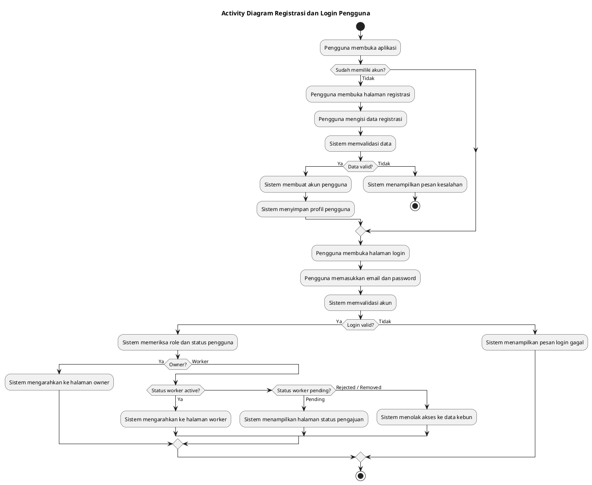

---

# 4. Activity Diagram Owner Membuat Kebun

## Deskripsi

Alur ini menjelaskan proses owner membuat data kebun sebagai ruang kerja utama dalam aplikasi. Setelah kebun dibuat, sistem menghasilkan kode bergabung yang dapat digunakan worker untuk mengajukan akses.

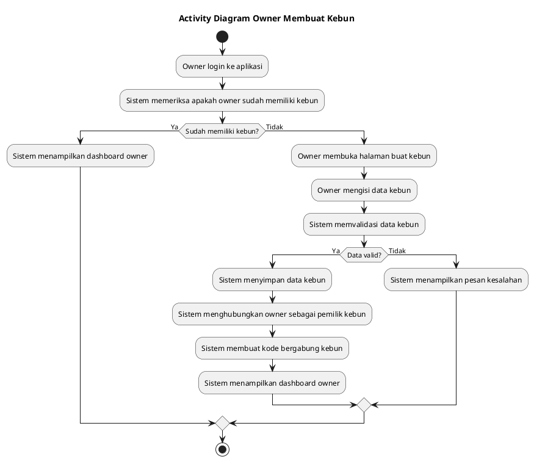

---

# 5. Activity Diagram Worker Mengajukan Bergabung ke Kebun

## Deskripsi

Alur ini menjelaskan proses worker mengajukan akses ke kebun menggunakan kode bergabung yang diberikan oleh owner.

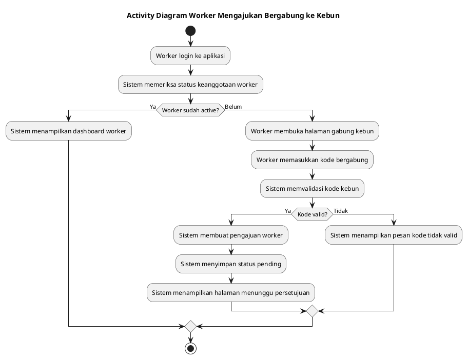

---

# 6. Activity Diagram Owner Mengelola Pengajuan Worker

## Deskripsi

Alur ini menjelaskan proses owner menerima atau menolak pengajuan worker. Owner juga dapat mengeluarkan worker aktif dari kebun jika worker sudah tidak terlibat dalam operasional.

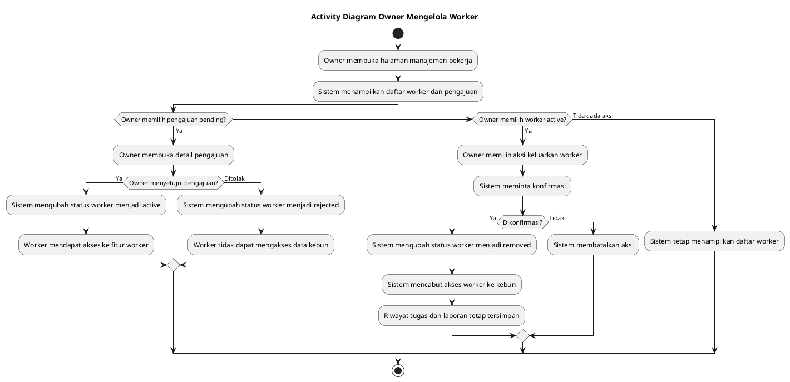

---

# 7. Activity Diagram Owner Mengelola Data Pohon

## Deskripsi

Alur ini menjelaskan proses owner mengelola data pohon, termasuk tambah, edit, dan arsip data pohon. Data pohon digunakan sebagai dasar pencatatan kondisi, fase, dan riwayat perawatan.

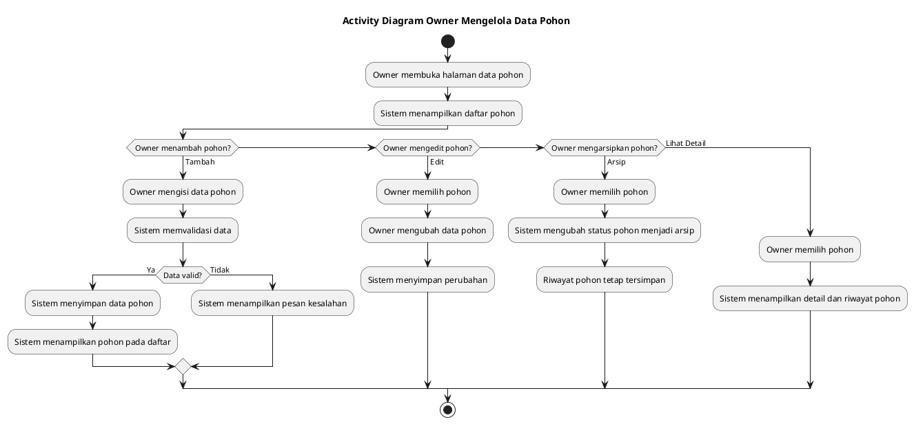

---

# 8. Activity Diagram Pengguna Mencatat Kondisi Pohon

## Deskripsi

Alur ini menjelaskan proses owner atau worker mencatat kondisi pohon. Data kondisi digunakan untuk memperbarui kondisi terbaru pohon dan menambah riwayat kondisi pohon.

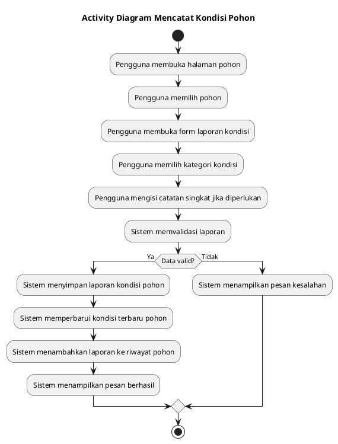

---

# 9. Activity Diagram Worker Membuat Laporan Operasional Kebun

## Deskripsi

Alur ini menjelaskan proses worker membuat laporan operasional kebun untuk kejadian yang tidak selalu berkaitan dengan pohon tertentu, seperti kerusakan lahan, alat rusak, stok habis, bencana, atau kebutuhan pekerja.

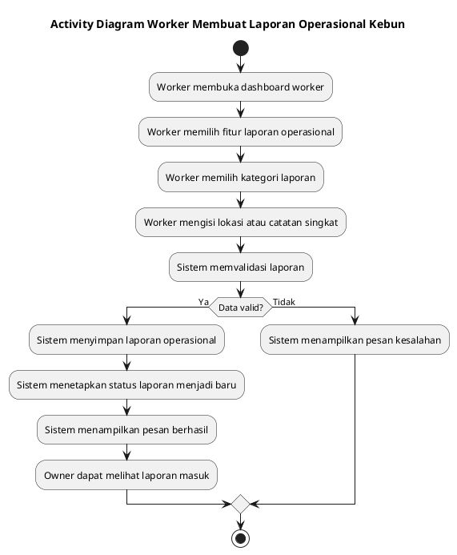

---

# 10. Activity Diagram Owner Menindaklanjuti Laporan Operasional

## Deskripsi

Alur ini menjelaskan proses owner melihat laporan operasional, mengubah status laporan, dan membuat tugas tindak lanjut jika laporan membutuhkan aksi dari worker.

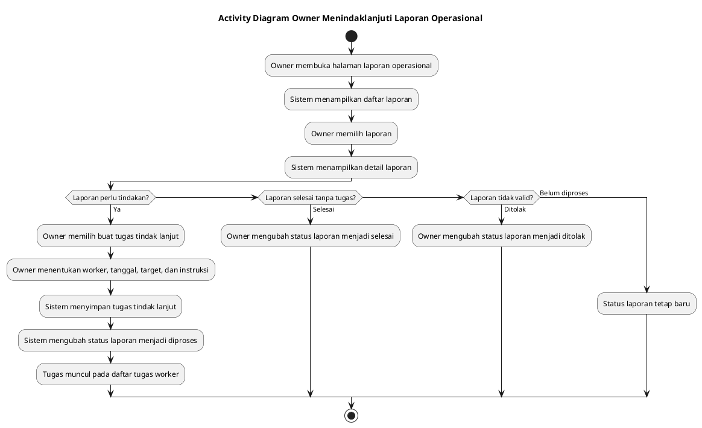

---

# 11. Activity Diagram Owner Mengelola SOP Perawatan

## Deskripsi

Alur ini menjelaskan proses owner membuat, mengubah, mengaktifkan, atau menonaktifkan SOP perawatan. SOP digunakan sebagai template standar untuk membuat jadwal perawatan.

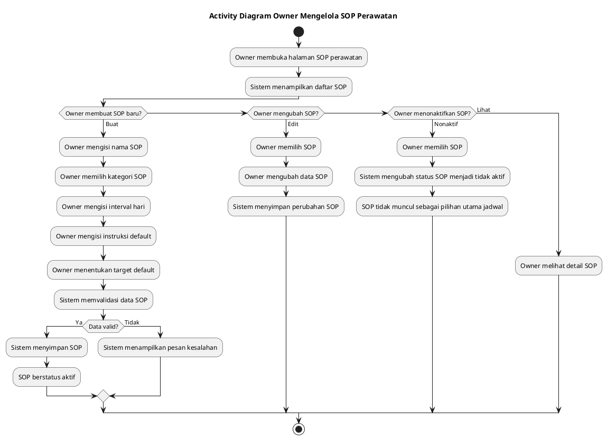

---

# 12. Activity Diagram Owner Membuat Jadwal dan Tugas dari SOP

## Deskripsi

Alur ini menjelaskan proses owner membuat jadwal dari SOP. Sistem membantu menghitung acuan jadwal berikutnya berdasarkan tanggal realisasi terakhir dan interval SOP, tetapi tidak membuat tugas otomatis tanpa konfirmasi owner.

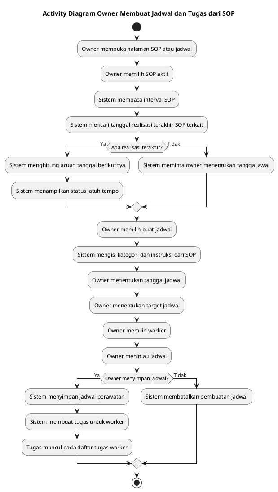

---

# 13. Activity Diagram Worker Melihat dan Merealisasikan Tugas

## Deskripsi

Alur ini menjelaskan proses worker melihat tugas, membuka detail tugas, lalu menandai tugas sebagai selesai atau tertunda. Realisasi tugas akan menjadi riwayat perawatan.

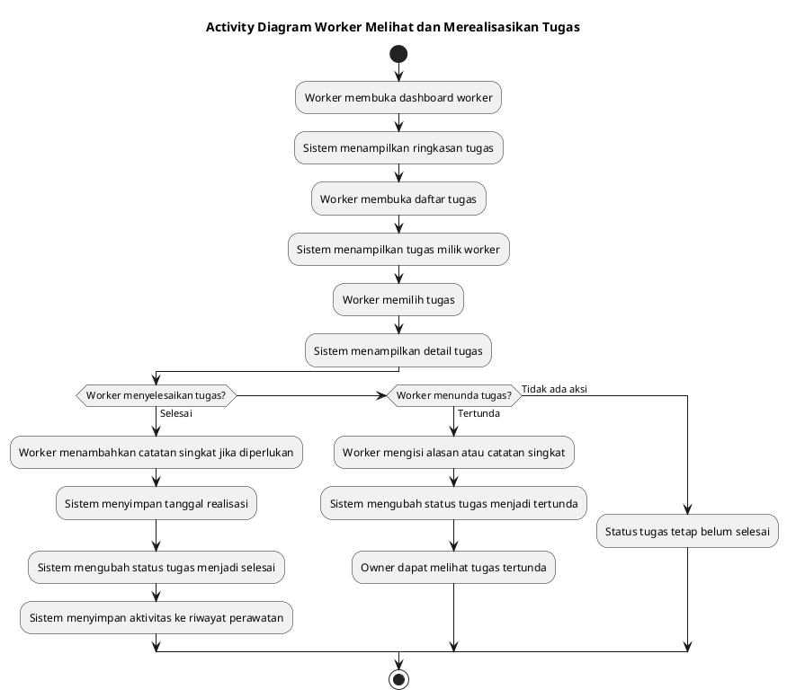

---

# 14. Activity Diagram Pengguna Mencatat Fase Pertumbuhan Pohon

## Deskripsi

Alur ini menjelaskan proses owner atau worker mencatat fase pertumbuhan pohon. Sistem memperbarui fase terbaru pohon dan menyimpan riwayat fase.

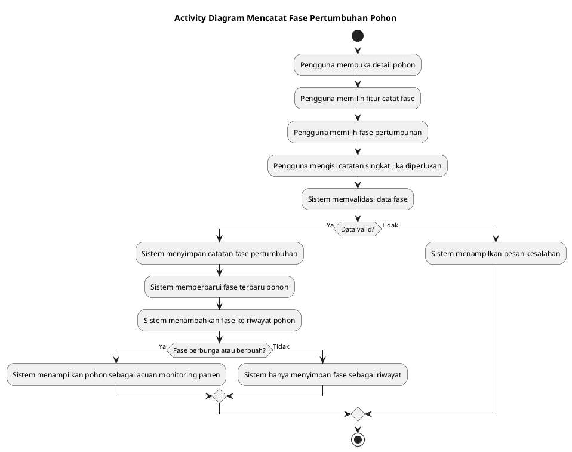

---

# 15. Activity Diagram Owner Melihat Dashboard

## Deskripsi

Alur ini menjelaskan proses sistem menampilkan dashboard owner. Dashboard berisi ringkasan data penting agar owner dapat mengambil keputusan cepat.

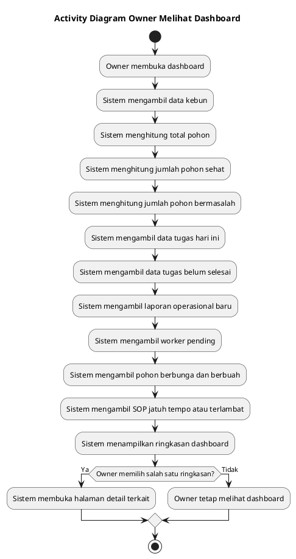

---

# 16. Catatan Batasan Activity Diagram

Activity diagram Avology V2 tidak mencakup fitur berikut:

1. Prediksi panen otomatis
2. Machine learning
3. Push notification
4. IoT atau sensor
5. API cuaca
6. Chat owner-worker
7. Akuntansi lengkap
8. Laporan PDF otomatis
9. Integrated farming
10. Marketplace
11. Grading buah
12. Sistem kelompok tani
13. Recurring task otomatis tanpa konfirmasi owner

Fitur tersebut tidak termasuk MVP dan hanya dapat dipertimbangkan sebagai pengembangan lanjutan.

---

# 17. Ringkasan Alur Sistem

Secara umum, alur kerja Avology V2 adalah sebagai berikut:

1. Owner membuat kebun.
2. Worker mengajukan bergabung menggunakan kode kebun.
3. Owner menyetujui worker.
4. Owner mengelola data pohon.
5. Owner membuat SOP perawatan.
6. Sistem membantu menampilkan acuan jadwal berikutnya berdasarkan interval SOP.
7. Owner membuat jadwal dan tugas untuk worker.
8. Worker melihat dan merealisasikan tugas.
9. Worker atau owner mencatat kondisi serta fase pertumbuhan pohon.
10. Worker dapat membuat laporan operasional kebun.
11. Owner dapat menindaklanjuti laporan menjadi tugas.
12. Sistem menyimpan riwayat kondisi, perawatan, fase, dan laporan.
13. Owner memantau kondisi kebun melalui dashboard.
