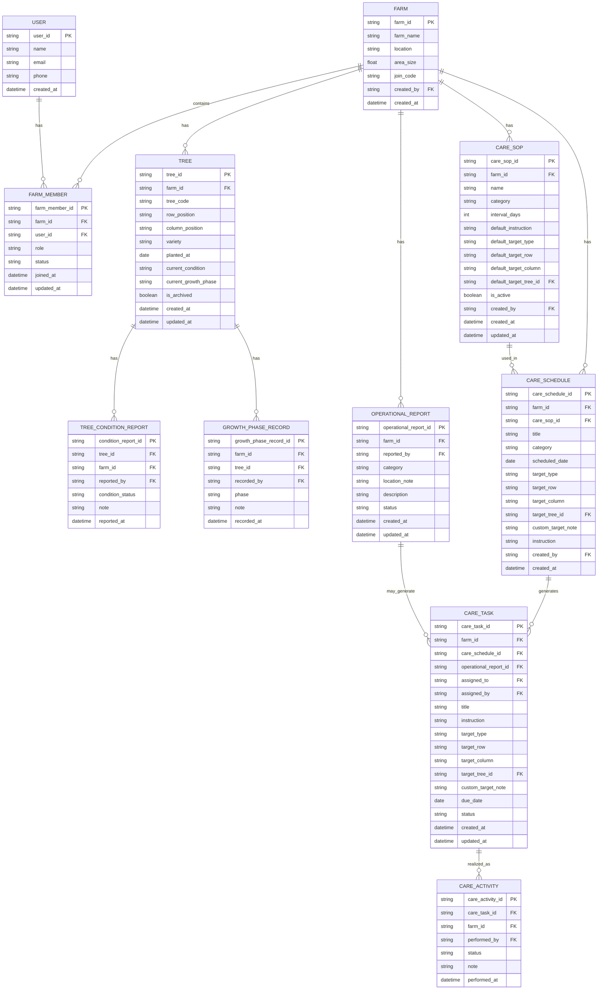

# Data Model dan ERD Konseptual Avology V2

## 1. Tujuan Data Model

Data model digunakan untuk menjelaskan struktur data utama yang dibutuhkan dalam sistem Avology V2. Model ini diturunkan dari MVP Scope, kebutuhan fungsional, user story, use case, dan activity diagram yang telah disusun sebelumnya.

Data model ini masih berada pada tahap konseptual dan digunakan sebagai dasar untuk penyusunan ERD serta desain database implementasi.

---

# 2. Prinsip Perancangan Data

Perancangan data Avology V2 menggunakan prinsip berikut:

1. Setiap data utama harus berhubungan dengan kebun.
2. Setiap pengguna memiliki role berdasarkan keanggotaannya di kebun.
3. Data pohon dicatat secara individual.
4. Kondisi, fase, dan perawatan pohon disimpan sebagai riwayat.
5. Worker yang dikeluarkan tidak dihapus permanen agar histori tugas dan laporan tetap dapat dilacak.
6. SOP digunakan sebagai template standar perawatan, bukan dokumen panjang.
7. Interval SOP digunakan sebagai acuan jadwal berikutnya, bukan sebagai recurring task otomatis penuh.
8. Laporan operasional kebun dipisahkan dari laporan kondisi pohon.
9. Tugas worker dapat berasal dari jadwal perawatan atau laporan operasional.
10. Dashboard tidak menyimpan data terpisah, tetapi mengambil ringkasan dari data yang sudah ada.

---

# 3. Entitas Utama

## 3.1 User

Entitas **User** merepresentasikan pengguna aplikasi, baik owner maupun worker.

### Atribut Utama

| Atribut    | Keterangan              |
| ---------- | ----------------------- |
| user_id    | Identitas unik pengguna |
| name       | Nama pengguna           |
| email      | Email pengguna          |
| phone      | Nomor telepon pengguna  |
| created_at | Tanggal akun dibuat     |

### Catatan

Role pengguna tidak disimpan langsung pada User, tetapi ditentukan melalui relasi keanggotaan pada entitas **FarmMember**. Dengan begitu, satu struktur data bisa membedakan apakah pengguna adalah owner atau worker dalam suatu kebun.

---

## 3.2 Farm

Entitas **Farm** merepresentasikan data kebun yang dikelola dalam sistem.

### Atribut Utama

| Atribut    | Keterangan                  |
| ---------- | --------------------------- |
| farm_id    | Identitas unik kebun        |
| farm_name  | Nama kebun                  |
| location   | Lokasi kebun                |
| area_size  | Luas kebun                  |
| join_code  | Kode bergabung untuk worker |
| created_by | User yang membuat kebun     |
| created_at | Tanggal kebun dibuat        |

### Catatan

Dalam MVP, sistem dapat dibatasi untuk satu kebun aktif per owner agar alur tetap sederhana. Namun, struktur data tetap dibuat cukup fleksibel untuk pengembangan multi-kebun di masa depan. Wah, akhirnya fleksibel tanpa berubah jadi monster enterprise. Jarang terjadi.

---

## 3.3 FarmMember

Entitas **FarmMember** merepresentasikan keanggotaan pengguna dalam kebun.

### Atribut Utama

| Atribut        | Keterangan                    |
| -------------- | ----------------------------- |
| farm_member_id | Identitas unik keanggotaan    |
| farm_id        | Kebun yang diikuti            |
| user_id        | Pengguna yang menjadi anggota |
| role           | Role pengguna dalam kebun     |
| status         | Status keanggotaan            |
| joined_at      | Tanggal bergabung             |
| updated_at     | Tanggal perubahan status      |

### Nilai Role

| Role   | Keterangan    |
| ------ | ------------- |
| owner  | Pemilik kebun |
| worker | Pekerja kebun |

### Nilai Status

| Status   | Keterangan                                           |
| -------- | ---------------------------------------------------- |
| pending  | Worker mengajukan bergabung dan menunggu persetujuan |
| active   | Worker aktif dan dapat mengakses kebun               |
| rejected | Pengajuan worker ditolak                             |
| removed  | Worker dikeluarkan dari kebun                        |

### Catatan

Worker yang dikeluarkan dari kebun tidak dihapus permanen. Statusnya diubah menjadi **removed** agar riwayat tugas dan laporan tetap dapat ditelusuri.

---

## 3.4 Tree

Entitas **Tree** merepresentasikan pohon alpukat yang dicatat secara individual.

### Atribut Utama

| Atribut              | Keterangan                    |
| -------------------- | ----------------------------- |
| tree_id              | Identitas unik pohon          |
| farm_id              | Kebun tempat pohon berada     |
| tree_code            | Kode atau nomor pohon         |
| row_position         | Posisi baris                  |
| column_position      | Posisi kolom                  |
| variety              | Varietas pohon                |
| planted_at           | Tanggal tanam                 |
| current_condition    | Kondisi terbaru pohon         |
| current_growth_phase | Fase pertumbuhan terbaru      |
| is_archived          | Status arsip pohon            |
| created_at           | Tanggal data pohon dibuat     |
| updated_at           | Tanggal data pohon diperbarui |

### Catatan

Tree menjadi pusat data untuk kondisi pohon, fase pertumbuhan, dan riwayat perawatan. Setiap pohon harus dapat ditelusuri secara individual karena hasil wawancara menunjukkan bahwa perkembangan tiap pohon tidak selalu sama.

---

## 3.5 TreeConditionReport

Entitas **TreeConditionReport** merepresentasikan laporan kondisi pohon.

### Atribut Utama

| Atribut             | Keterangan                     |
| ------------------- | ------------------------------ |
| condition_report_id | Identitas unik laporan kondisi |
| tree_id             | Pohon yang dilaporkan          |
| farm_id             | Kebun terkait                  |
| reported_by         | User yang membuat laporan      |
| condition_status    | Status kondisi pohon           |
| note                | Catatan singkat                |
| reported_at         | Tanggal laporan dibuat         |

### Nilai Condition Status

| Status            | Keterangan                 |
| ----------------- | -------------------------- |
| healthy           | Pohon sehat                |
| needs_attention   | Pohon perlu perhatian      |
| pest_attacked     | Pohon terserang hama       |
| disease_indicated | Pohon terindikasi penyakit |
| damaged           | Pohon rusak                |
| dead              | Pohon mati                 |

### Catatan

Setiap laporan kondisi akan menjadi bagian dari riwayat pohon. Laporan terbaru dapat digunakan untuk memperbarui atribut **current_condition** pada entitas Tree.

---

## 3.6 OperationalReport

Entitas **OperationalReport** merepresentasikan laporan operasional kebun yang tidak selalu berkaitan dengan pohon individual.

### Atribut Utama

| Atribut               | Keterangan                         |
| --------------------- | ---------------------------------- |
| operational_report_id | Identitas unik laporan operasional |
| farm_id               | Kebun terkait                      |
| reported_by           | Worker yang membuat laporan        |
| category              | Kategori laporan                   |
| location_note         | Catatan lokasi                     |
| description           | Deskripsi singkat laporan          |
| status                | Status laporan                     |
| created_at            | Tanggal laporan dibuat             |
| updated_at            | Tanggal status diperbarui          |

### Nilai Category

| Kategori          | Keterangan                 |
| ----------------- | -------------------------- |
| land_damage       | Kerusakan lahan            |
| broken_tool       | Alat rusak                 |
| out_of_stock      | Stok habis                 |
| area_pest_disease | Hama atau penyakit area    |
| disaster_weather  | Bencana atau cuaca ekstrem |
| worker_need       | Kebutuhan pekerja          |
| other             | Lainnya                    |

### Nilai Status

| Status      | Keterangan      |
| ----------- | --------------- |
| new         | Laporan baru    |
| in_progress | Sedang diproses |
| resolved    | Selesai         |
| rejected    | Ditolak         |

### Catatan

OperationalReport dipisahkan dari TreeConditionReport karena tidak semua kejadian lapangan berkaitan dengan pohon tertentu. Contohnya alat rusak, stok pupuk habis, saluran air bermasalah, atau kebutuhan tenaga tambahan.

---

## 3.7 CareSOP

Entitas **CareSOP** merepresentasikan template standar perawatan kebun.

### Atribut Utama

| Atribut             | Keterangan                    |
| ------------------- | ----------------------------- |
| care_sop_id         | Identitas unik SOP            |
| farm_id             | Kebun terkait                 |
| name                | Nama SOP                      |
| category            | Kategori perawatan            |
| interval_days       | Interval perawatan dalam hari |
| default_instruction | Instruksi default             |
| default_target_type | Target default SOP            |
| default_target_row  | Target baris default          |
| default_target_column | Target kolom default        |
| default_target_tree_id | Target pohon default       |
| is_active           | Status aktif SOP              |
| created_by          | Owner yang membuat SOP        |
| created_at          | Tanggal SOP dibuat            |
| updated_at          | Tanggal SOP diperbarui        |

Default target SOP hanya menggunakan target terstruktur: farm, row, column, atau tree. Target `custom` tidak digunakan pada `care_sops` dalam MVP.

### Nilai Category

| Kategori    | Keterangan         |
| ----------- | ------------------ |
| watering    | Penyiraman         |
| fertilizing | Pemupukan          |
| spraying    | Penyemprotan       |
| weeding     | Pengendalian gulma |
| other       | Lainnya            |

### Nilai Default Target Type

| Target | Keterangan     |
| ------ | -------------- |
| farm   | Seluruh kebun  |
| row    | Baris tertentu |
| column | Kolom tertentu |
| tree   | Pohon tertentu |

### Catatan

CareSOP bukan dokumen panjang. CareSOP adalah template yang menyimpan kategori, interval, instruksi, dan target default agar owner dapat membuat jadwal perawatan secara lebih konsisten.

---

## 3.8 CareSchedule

Entitas **CareSchedule** merepresentasikan jadwal perawatan yang dibuat owner.

### Atribut Utama

| Atribut          | Keterangan                                   |
| ---------------- | -------------------------------------------- |
| care_schedule_id | Identitas unik jadwal                        |
| farm_id          | Kebun terkait                                |
| care_sop_id      | SOP yang digunakan, boleh kosong jika manual |
| title            | Judul jadwal                                 |
| category         | Kategori jadwal                              |
| scheduled_date   | Tanggal jadwal                               |
| target_type      | Jenis target jadwal                          |
| target_row       | Target baris, jika target berupa baris       |
| target_column    | Target kolom, jika target berupa kolom       |
| target_tree_id   | Target pohon, jika target berupa pohon       |
| custom_target_note | Catatan target custom, khusus jadwal manual atau tugas tindak lanjut yang dibuat manual oleh owner |
| instruction      | Instruksi perawatan                          |
| created_by       | Owner yang membuat jadwal                    |
| created_at       | Tanggal jadwal dibuat                        |

### Nilai Target Type

| Target | Keterangan     |
| ------ | -------------- |
| farm   | Seluruh kebun  |
| row    | Baris tertentu |
| column | Kolom tertentu |
| tree   | Pohon tertentu |
| custom | Target bebas untuk jadwal manual atau task tindak lanjut |

### Catatan

Jadwal dapat dibuat dari SOP atau dibuat manual. Jika jadwal dibuat dari SOP, beberapa data seperti kategori dan instruksi dapat otomatis terisi dari template SOP.

---

## 3.9 CareTask

Entitas **CareTask** merepresentasikan tugas yang diberikan kepada worker berdasarkan jadwal perawatan atau tindak lanjut laporan operasional.

### Atribut Utama

| Atribut               | Keterangan                                                    |
| --------------------- | ------------------------------------------------------------- |
| care_task_id          | Identitas unik tugas                                          |
| farm_id               | Kebun terkait                                                 |
| care_schedule_id      | Jadwal asal tugas, boleh kosong jika dari laporan operasional |
| operational_report_id | Laporan operasional asal tugas, boleh kosong jika dari jadwal |
| assigned_to           | Worker yang menerima tugas                                    |
| assigned_by           | Owner yang membuat tugas                                      |
| title                 | Judul tugas                                                   |
| instruction           | Instruksi tugas                                               |
| target_type           | Jenis target tugas                                            |
| target_row            | Target baris, jika target berupa baris                        |
| target_column         | Target kolom, jika target berupa kolom                        |
| target_tree_id        | Target pohon, jika target berupa pohon                        |
| custom_target_note    | Catatan target custom, jika target berupa custom pada tugas manual atau tindak lanjut |
| due_date              | Tanggal pelaksanaan tugas                                     |
| status                | Status tugas                                                  |
| created_at            | Tanggal tugas dibuat                                          |
| updated_at            | Tanggal tugas diperbarui                                      |

### Nilai Status

| Status    | Keterangan    |
| --------- | ------------- |
| pending   | Belum selesai |
| completed | Selesai       |
| postponed | Tertunda      |

### Catatan

CareTask dapat berasal dari dua sumber:

1. Jadwal perawatan.
2. Tindak lanjut laporan operasional.

Dengan desain ini, tugas worker tidak hanya terbatas pada perawatan pohon, tetapi juga bisa mencakup perbaikan lahan, pengecekan stok, atau tindak lanjut kejadian lapangan.

---

## 3.10 CareActivity

Entitas **CareActivity** merepresentasikan realisasi dari tugas worker.

### Atribut Utama

| Atribut          | Keterangan                       |
| ---------------- | -------------------------------- |
| care_activity_id | Identitas unik aktivitas         |
| care_task_id     | Tugas yang direalisasikan        |
| farm_id          | Kebun terkait                    |
| performed_by     | Worker yang merealisasikan tugas |
| status           | Status realisasi                 |
| note             | Catatan realisasi                |
| performed_at     | Tanggal realisasi                |

### Nilai Status

| Status    | Keterangan     |
| --------- | -------------- |
| completed | Tugas selesai  |
| postponed | Tugas tertunda |

### Catatan

CareActivity digunakan untuk menyimpan bukti realisasi tugas. Jika tugas berkaitan dengan pohon tertentu, aktivitas dapat muncul dalam riwayat pohon melalui `target_tree_id` pada CareTask. CareActivity tidak menyimpan `tree_id` langsung pada MVP.

---

## 3.11 GrowthPhaseRecord

Entitas **GrowthPhaseRecord** merepresentasikan catatan fase pertumbuhan pohon.

### Atribut Utama

| Atribut                | Keterangan                  |
| ---------------------- | --------------------------- |
| growth_phase_record_id | Identitas unik catatan fase |
| farm_id                | Kebun terkait               |
| tree_id                | Pohon terkait               |
| recorded_by            | User yang mencatat fase     |
| phase                  | Fase pertumbuhan            |
| note                   | Catatan singkat             |
| recorded_at            | Tanggal pencatatan fase     |

### Nilai Phase

| Phase            | Keterangan |
| ---------------- | ---------- |
| initial_planting | Awal tanam |
| vegetative       | Vegetatif  |
| flowering        | Berbunga   |
| fruiting         | Berbuah    |
| harvesting       | Panen      |

### Catatan

GrowthPhaseRecord digunakan untuk mencatat perkembangan pohon secara historis. Sistem tidak menggunakan data ini untuk prediksi panen otomatis, tetapi untuk monitoring pohon yang sedang berbunga atau berbuah.

---

# 4. Relasi Antar Entitas

## 4.1 User dan FarmMember

Satu User dapat memiliki banyak FarmMember.

Relasi:

```txt
User 1..N FarmMember
```

Artinya, seorang pengguna dapat menjadi anggota pada satu atau lebih kebun jika sistem dikembangkan lebih lanjut. Untuk MVP, penggunaan dapat dibatasi pada satu kebun aktif.

---

## 4.2 Farm dan FarmMember

Satu Farm memiliki banyak FarmMember.

Relasi:

```txt
Farm 1..N FarmMember
```

Artinya, satu kebun dapat memiliki satu owner dan beberapa worker.

---

## 4.3 Farm dan Tree

Satu Farm memiliki banyak Tree.

Relasi:

```txt
Farm 1..N Tree
```

Artinya, setiap pohon harus terhubung dengan satu kebun tertentu.

---

## 4.4 Tree dan TreeConditionReport

Satu Tree memiliki banyak TreeConditionReport.

Relasi:

```txt
Tree 1..N TreeConditionReport
```

Artinya, setiap pohon dapat memiliki banyak catatan kondisi dari waktu ke waktu.

---

## 4.5 Farm dan OperationalReport

Satu Farm memiliki banyak OperationalReport.

Relasi:

```txt
Farm 1..N OperationalReport
```

Artinya, laporan operasional selalu berkaitan dengan satu kebun, tetapi tidak selalu berkaitan dengan pohon tertentu.

---

## 4.6 Farm dan CareSOP

Satu Farm memiliki banyak CareSOP.

Relasi:

```txt
Farm 1..N CareSOP
```

Artinya, SOP dibuat untuk kebutuhan operasional satu kebun tertentu.

---

## 4.7 CareSOP dan CareSchedule

Satu CareSOP dapat digunakan oleh banyak CareSchedule.

Relasi:

```txt
CareSOP 1..N CareSchedule
```

Artinya, satu template SOP dapat digunakan berulang untuk membuat jadwal perawatan. CareSchedule tetap dapat dibuat tanpa SOP, sehingga relasi ini bersifat opsional pada sisi CareSchedule.

---

## 4.8 CareSchedule dan CareTask

Satu CareSchedule dapat menghasilkan satu atau lebih CareTask.

Relasi:

```txt
CareSchedule 1..N CareTask
```

Artinya, satu jadwal dapat menghasilkan tugas untuk worker.

---

## 4.9 OperationalReport dan CareTask

Satu OperationalReport dapat menghasilkan nol atau lebih CareTask.

Relasi:

```txt
OperationalReport 0..N CareTask
```

Artinya, laporan operasional tidak selalu harus ditindaklanjuti dengan tugas, tetapi jika perlu tindakan, owner dapat membuat tugas dari laporan tersebut.

---

## 4.10 CareTask dan CareActivity

Satu CareTask dapat memiliki nol atau banyak CareActivity.

Relasi:

```txt
CareTask 0..N CareActivity
```

Artinya, tugas yang belum dikerjakan belum memiliki aktivitas. Setelah worker menunda atau menyelesaikan tugas, sistem menyimpan setiap realisasi sebagai CareActivity sehingga satu tugas dapat memiliki lebih dari satu riwayat aktivitas.

---

## 4.11 Tree dan CareActivity

Satu Tree dapat memiliki banyak CareActivity secara tidak langsung melalui target pohon pada CareTask.

Relasi:

```txt
Tree 1..N CareActivity
```

Namun relasi ini bersifat turunan, bukan foreign key langsung di CareActivity. Dalam MVP, CareActivity tidak menyimpan `tree_id`; riwayat pohon mengambil aktivitas perawatan melalui `CareTask.target_tree_id`.

---

## 4.12 Tree dan GrowthPhaseRecord

Satu Tree memiliki banyak GrowthPhaseRecord.

Relasi:

```txt
Tree 1..N GrowthPhaseRecord
```

Artinya, setiap perubahan fase pohon dicatat sebagai riwayat.

---

# 5. Ringkasan Cardinality

| Entitas A         | Relasi | Entitas B           | Keterangan                                |
| ----------------- | ------ | ------------------- | ----------------------------------------- |
| User              | 1..N   | FarmMember          | User dapat menjadi anggota kebun          |
| Farm              | 1..N   | FarmMember          | Kebun memiliki owner dan worker           |
| Farm              | 1..N   | Tree                | Kebun memiliki banyak pohon               |
| Tree              | 1..N   | TreeConditionReport | Pohon memiliki banyak laporan kondisi     |
| Farm              | 1..N   | OperationalReport   | Kebun memiliki banyak laporan operasional |
| Farm              | 1..N   | CareSOP             | Kebun memiliki banyak SOP                 |
| CareSOP           | 0..N   | CareSchedule        | SOP dapat digunakan pada banyak jadwal    |
| Farm              | 1..N   | CareSchedule        | Kebun memiliki banyak jadwal              |
| CareSchedule      | 1..N   | CareTask            | Jadwal menghasilkan tugas                 |
| OperationalReport | 0..N   | CareTask            | Laporan dapat menghasilkan tugas          |
| CareTask          | 0..N   | CareActivity        | Tugas dapat belum punya atau punya banyak realisasi |
| Tree              | 0..N   | CareActivity        | Pohon dapat memiliki riwayat perawatan melalui target pohon pada CareTask |
| Tree              | 1..N   | GrowthPhaseRecord   | Pohon memiliki riwayat fase               |

---

# 6. ERD Konseptual dalam Bentuk Mermaid

Kode berikut dapat digunakan sebagai gambaran ERD konseptual.



---

# 7. Catatan untuk ERD Chen

Jika ERD harus dibuat dengan notasi Chen, maka entitas utama yang perlu digambar adalah:

1. User
2. Farm
3. FarmMember
4. Tree
5. TreeConditionReport
6. OperationalReport
7. CareSOP
8. CareSchedule
9. CareTask
10. CareActivity
11. GrowthPhaseRecord

Relasi Chen yang perlu digambar:

1. User menjadi FarmMember
2. Farm memiliki FarmMember
3. Farm memiliki Tree
4. Tree memiliki TreeConditionReport
5. Farm memiliki OperationalReport
6. Farm memiliki CareSOP
7. CareSOP digunakan pada CareSchedule
8. Farm memiliki CareSchedule
9. CareSchedule menghasilkan CareTask
10. OperationalReport dapat menghasilkan CareTask
11. CareTask direalisasikan menjadi CareActivity
12. Tree memiliki CareActivity
13. Tree memiliki GrowthPhaseRecord

Dalam Chen ERD, entitas **FarmMember** dapat diposisikan sebagai entitas asosiatif antara User dan Farm karena menyimpan atribut tambahan seperti role dan status.

---

# 8. Catatan Desain Penting

## 8.1 Dashboard Tidak Menjadi Entitas

Dashboard owner dan worker tidak dibuat sebagai tabel tersendiri. Dashboard hanya mengambil ringkasan dari data yang sudah ada, seperti:

* Tree
* TreeConditionReport
* OperationalReport
* FarmMember
* CareSOP
* CareSchedule
* CareTask
* GrowthPhaseRecord

Dengan begitu, dashboard tidak menyebabkan duplikasi data.

---

## 8.2 Riwayat Pohon Tidak Harus Menjadi Tabel Fisik

Riwayat pohon dapat dibentuk dari gabungan beberapa data:

* TreeConditionReport
* CareActivity
* GrowthPhaseRecord

Dalam implementasi, riwayat pohon bisa dibuat melalui query gabungan atau database view.

Jadi, tidak wajib ada tabel khusus bernama TreeHistory. Kalau tetap dibuat sembarangan, nanti database lu punya museum riwayat palsu. Menarik, tapi menyebalkan.

---

## 8.3 Penghapusan Data Harus Hati-Hati

Untuk data yang punya histori, lebih baik menggunakan status atau arsip daripada delete permanen.

Contoh:

* Worker dikeluarkan menggunakan status removed.
* Pohon tidak aktif menggunakan is_archived.
* SOP tidak digunakan menggunakan is_active = false.
* Laporan dan aktivitas tetap disimpan sebagai histori.

---

## 8.4 SOP Tidak Membuat Tugas Otomatis Penuh

CareSOP hanya menyimpan interval dan template. Sistem menghitung acuan jadwal berikutnya berdasarkan:

tanggal realisasi terakhir + interval SOP

Namun, sistem tidak membuat tugas berulang otomatis tanpa konfirmasi owner.

---

## 8.5 Laporan Kondisi Pohon dan Laporan Operasional Dipisahkan

TreeConditionReport digunakan untuk laporan yang berhubungan dengan pohon tertentu.

OperationalReport digunakan untuk laporan umum kebun seperti alat rusak, stok habis, bencana, kerusakan lahan, atau kebutuhan pekerja.

Pemisahan ini penting agar data tidak tercampur. Karena pohon sakit dan cangkul patah memang sama-sama masalah, tapi memaksa mereka tinggal di tabel yang sama adalah tindakan yang tidak berperikemanusiaan terhadap database.

---

# 9. Ringkasan Entitas Final

| Entitas             | Fungsi Utama                             |
| ------------------- | ---------------------------------------- |
| User                | Menyimpan data pengguna                  |
| Farm                | Menyimpan data kebun                     |
| FarmMember          | Menyimpan role dan status anggota kebun  |
| Tree                | Menyimpan data pohon individual          |
| TreeConditionReport | Menyimpan laporan kondisi pohon          |
| OperationalReport   | Menyimpan laporan operasional kebun      |
| CareSOP             | Menyimpan template standar perawatan     |
| CareSchedule        | Menyimpan jadwal perawatan               |
| CareTask            | Menyimpan tugas worker                   |
| CareActivity        | Menyimpan realisasi tugas                |
| GrowthPhaseRecord   | Menyimpan riwayat fase pertumbuhan pohon |

---

# 10. Batasan Data Model MVP

Data model MVP tidak mencakup entitas untuk:

1. Prediksi panen otomatis
2. Machine learning
3. Push notification
4. IoT atau sensor
5. Cuaca
6. Chat owner-worker
7. Akuntansi lengkap
8. Laporan PDF otomatis
9. Integrated farming
10. Marketplace
11. Grading buah
12. Kelompok tani
13. Recurring task otomatis penuh
14. Peternakan
15. Supply chain restoran atau warung

Entitas tersebut dapat dipertimbangkan pada pengembangan lanjutan jika kebutuhan dan data pendukung sudah tersedia.
