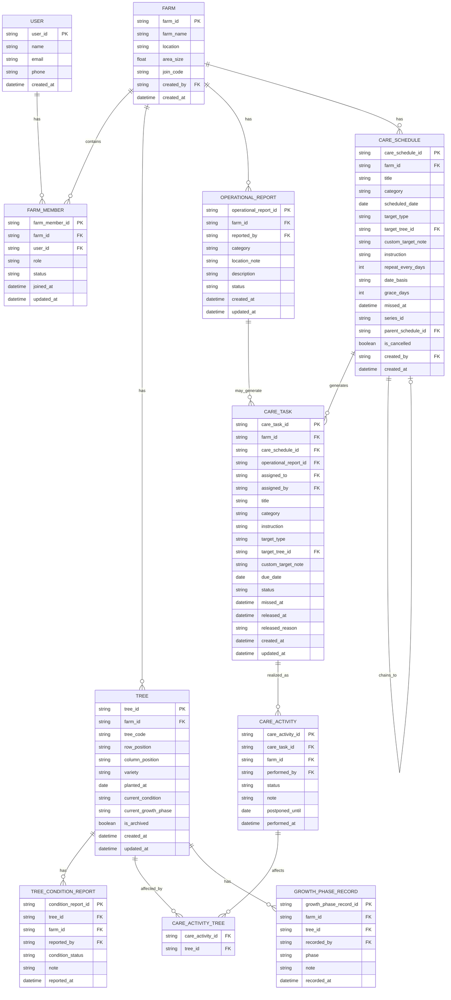

# Data Model dan ERD Konseptual Avology V2

> **Catatan perubahan (migrasi 046 & 047).** Entitas **CareSOP** beserta relasi
> Farm–CareSOP dan CareSOP–CareSchedule dihapus, begitu juga atribut
> `target_row`/`target_column` pada CareSchedule dan CareTask serta nilai target
> `row`/`column`. Penomoran entitas dan relasi dirapatkan karena tidak dirujuk
> dokumen lain. Atribut `row_position`/`column_position` pada entitas **Tree**
> TIDAK terpengaruh — itu posisi fisik pohon, bukan target jadwal. Riwayat
> keputusannya ada di `decision-log.md`.

> **Catatan perubahan (migrasi 048–052).** Entitas **CareSchedule** bertambah
> atribut rantai dan masa toleransi, **CareTask** bertambah penanda terlewat dan
> pelepasan, dan **CareActivity** bertambah tanggal penundaan. Entitas baru
> **CareActivityTree** ditambahkan sebagai jembatan aktivitas–pohon; jembatan ini
> sebenarnya sudah ada di database sejak migrasi 025 tetapi belum pernah masuk
> dokumen, dan migrasi 050 membuatnya menjadi satu-satunya jalan aktivitas
> perawatan masuk ke riwayat pohon. Riwayat keputusannya ada di
> `decision-log.md` (DL-034 sampai DL-038).

## 1. Tujuan Data Model

Data model digunakan untuk menjelaskan struktur data utama yang dibutuhkan dalam sistem Avology V2. Model ini diturunkan dari MVP Scope, kebutuhan fungsional, user story, use case, dan activity diagram yang telah disusun sebelumnya.

Data model ini masih berada pada tahap konseptual dan digunakan sebagai dasar untuk penyusunan ERD serta desain database implementasi.

---

# 2. Prinsip Perancangan Data

Perancangan data Avology V2 menggunakan prinsip berikut:

1. Setiap data utama harus berhubungan dengan kebun.
2. Setiap pengguna memiliki role berdasarkan keanggotaannya di kebun.
3. Data pohon dicatat secara individual.
4. Kondisi, fase, dan perawatan pohon disimpan sebagai riwayat.
5. Worker yang dikeluarkan tidak dihapus permanen agar histori tugas dan laporan tetap dapat dilacak.
6. Jadwal perawatan dibuat manual oleh owner, tanpa template terpisah.
7. Interval pengulangan pada jadwal digunakan sebagai acuan jadwal berikutnya, bukan sebagai recurring task otomatis penuh.
8. Laporan operasional kebun dipisahkan dari laporan kondisi pohon.
9. Tugas worker dapat berasal dari jadwal perawatan atau laporan operasional.
10. Dashboard tidak menyimpan data terpisah, tetapi mengambil ringkasan dari data yang sudah ada.

---

# 3. Entitas Utama

## 3.1 User

Entitas **User** merepresentasikan pengguna aplikasi, baik owner maupun worker.

### Atribut Utama

| Atribut    | Keterangan              |
| ---------- | ----------------------- |
| user_id    | Identitas unik pengguna |
| name       | Nama pengguna           |
| email      | Email pengguna          |
| phone      | Nomor telepon pengguna  |
| created_at | Tanggal akun dibuat     |

### Catatan

Role pengguna tidak disimpan langsung pada User, tetapi ditentukan melalui relasi keanggotaan pada entitas **FarmMember**. Dengan begitu, satu struktur data bisa membedakan apakah pengguna adalah owner atau worker dalam suatu kebun.

---

## 3.2 Farm

Entitas **Farm** merepresentasikan data kebun yang dikelola dalam sistem.

### Atribut Utama

| Atribut    | Keterangan                  |
| ---------- | --------------------------- |
| farm_id    | Identitas unik kebun        |
| farm_name  | Nama kebun                  |
| location   | Lokasi kebun                |
| area_size  | Luas kebun                  |
| join_code  | Kode bergabung untuk worker |
| created_by | User yang membuat kebun     |
| created_at | Tanggal kebun dibuat        |

### Catatan

Dalam MVP, sistem dapat dibatasi untuk satu kebun aktif per owner agar alur tetap sederhana. Namun, struktur data tetap dibuat cukup fleksibel untuk pengembangan multi-kebun di masa depan. Wah, akhirnya fleksibel tanpa berubah jadi monster enterprise. Jarang terjadi.

---

## 3.3 FarmMember

Entitas **FarmMember** merepresentasikan keanggotaan pengguna dalam kebun.

### Atribut Utama

| Atribut        | Keterangan                    |
| -------------- | ----------------------------- |
| farm_member_id | Identitas unik keanggotaan    |
| farm_id        | Kebun yang diikuti            |
| user_id        | Pengguna yang menjadi anggota |
| role           | Role pengguna dalam kebun     |
| status         | Status keanggotaan            |
| joined_at      | Tanggal bergabung             |
| updated_at     | Tanggal perubahan status      |

### Nilai Role

| Role   | Keterangan    |
| ------ | ------------- |
| owner  | Pemilik kebun |
| worker | Pekerja kebun |

### Nilai Status

| Status   | Keterangan                                           |
| -------- | ---------------------------------------------------- |
| pending  | Worker mengajukan bergabung dan menunggu persetujuan |
| active   | Worker aktif dan dapat mengakses kebun               |
| rejected | Pengajuan worker ditolak                             |
| removed  | Worker dikeluarkan dari kebun                        |

### Catatan

Worker yang dikeluarkan dari kebun tidak dihapus permanen. Statusnya diubah menjadi **removed** agar riwayat tugas dan laporan tetap dapat ditelusuri.

---

## 3.4 Tree

Entitas **Tree** merepresentasikan pohon alpukat yang dicatat secara individual.

### Atribut Utama

| Atribut              | Keterangan                    |
| -------------------- | ----------------------------- |
| tree_id              | Identitas unik pohon          |
| farm_id              | Kebun tempat pohon berada     |
| tree_code            | Kode atau nomor pohon         |
| row_position         | Posisi baris                  |
| column_position      | Posisi kolom                  |
| variety              | Varietas pohon                |
| planted_at           | Tanggal tanam                 |
| current_condition    | Kondisi terbaru pohon         |
| current_growth_phase | Fase pertumbuhan terbaru      |
| is_archived          | Status arsip pohon            |
| created_at           | Tanggal data pohon dibuat     |
| updated_at           | Tanggal data pohon diperbarui |

### Catatan

Tree menjadi pusat data untuk kondisi pohon, fase pertumbuhan, dan riwayat perawatan. Setiap pohon harus dapat ditelusuri secara individual karena hasil wawancara menunjukkan bahwa perkembangan tiap pohon tidak selalu sama.

---

## 3.5 TreeConditionReport

Entitas **TreeConditionReport** merepresentasikan laporan kondisi pohon.

### Atribut Utama

| Atribut             | Keterangan                     |
| ------------------- | ------------------------------ |
| condition_report_id | Identitas unik laporan kondisi |
| tree_id             | Pohon yang dilaporkan          |
| farm_id             | Kebun terkait                  |
| reported_by         | User yang membuat laporan      |
| condition_status    | Status kondisi pohon           |
| note                | Catatan singkat                |
| reported_at         | Tanggal laporan dibuat         |

### Nilai Condition Status

| Status            | Keterangan                 |
| ----------------- | -------------------------- |
| healthy           | Pohon sehat                |
| needs_attention   | Pohon perlu perhatian      |
| pest_attacked     | Pohon terserang hama       |
| disease_indicated | Pohon terindikasi penyakit |
| damaged           | Pohon rusak                |
| dead              | Pohon mati                 |

### Catatan

Setiap laporan kondisi akan menjadi bagian dari riwayat pohon. Laporan terbaru dapat digunakan untuk memperbarui atribut **current_condition** pada entitas Tree.

---

## 3.6 OperationalReport

Entitas **OperationalReport** merepresentasikan laporan operasional kebun yang tidak selalu berkaitan dengan pohon individual.

### Atribut Utama

| Atribut               | Keterangan                         |
| --------------------- | ---------------------------------- |
| operational_report_id | Identitas unik laporan operasional |
| farm_id               | Kebun terkait                      |
| reported_by           | Worker yang membuat laporan        |
| category              | Kategori laporan                   |
| location_note         | Catatan lokasi                     |
| description           | Deskripsi singkat laporan          |
| status                | Status laporan                     |
| created_at            | Tanggal laporan dibuat             |
| updated_at            | Tanggal status diperbarui          |

### Nilai Category

| Kategori          | Keterangan                 |
| ----------------- | -------------------------- |
| land_damage       | Kerusakan lahan            |
| broken_tool       | Alat rusak                 |
| out_of_stock      | Stok habis                 |
| area_pest_disease | Hama atau penyakit area    |
| disaster_weather  | Bencana atau cuaca ekstrem |
| worker_need       | Kebutuhan pekerja          |
| other             | Lainnya                    |

### Nilai Status

| Status      | Keterangan      |
| ----------- | --------------- |
| new         | Laporan baru    |
| in_progress | Sedang diproses |
| resolved    | Selesai         |
| rejected    | Ditolak         |

### Catatan

OperationalReport dipisahkan dari TreeConditionReport karena tidak semua kejadian lapangan berkaitan dengan pohon tertentu. Contohnya alat rusak, stok pupuk habis, saluran air bermasalah, atau kebutuhan tenaga tambahan.

---

## 3.7 CareSchedule

Entitas **CareSchedule** merepresentasikan jadwal perawatan yang dibuat owner.

### Atribut Utama

| Atribut          | Keterangan                                   |
| ---------------- | -------------------------------------------- |
| care_schedule_id | Identitas unik jadwal                        |
| farm_id          | Kebun terkait                                |
| title            | Judul jadwal                                 |
| category         | Kategori jadwal                              |
| scheduled_date   | Tanggal jadwal                               |
| target_type      | Jenis target jadwal                          |
| target_tree_id   | Target pohon, jika target berupa pohon       |
| custom_target_note | Catatan target custom, khusus jadwal atau tugas tindak lanjut yang dibuat manual oleh owner |
| instruction      | Instruksi perawatan                          |
| repeat_every_days | Interval pengulangan dalam hari, kosong jika jadwal sekali jalan |
| date_basis       | Dasar perhitungan tanggal penerus: `jadwal` atau `realisasi` |
| grace_days       | Masa toleransi keterlambatan dalam hari, kosong jika jadwal tidak pernah dinyatakan terlewat |
| missed_at        | Waktu jadwal dinyatakan terlewat, kosong jika belum terlewat |
| series_id        | Penanda satu rantai pengulangan, sama untuk seluruh siklus dalam rantai |
| parent_schedule_id | Jadwal pendahulu dalam rantai, kosong pada siklus pertama |
| is_cancelled     | Penanda jadwal dibatalkan owner               |
| created_by       | Owner yang membuat jadwal                    |
| created_at       | Tanggal jadwal dibuat                        |

### Nilai Category

| Kategori    | Keterangan         |
| ----------- | ------------------ |
| watering    | Penyiraman         |
| fertilizing | Pemupukan          |
| spraying    | Penyemprotan       |
| weeding     | Pengendalian gulma |
| other       | Lainnya            |

### Nilai Target Type

| Target | Keterangan     |
| ------ | -------------- |
| farm   | Seluruh kebun  |
| tree   | Pohon tertentu |
| custom | Target bebas berupa catatan, untuk jadwal atau task tindak lanjut |

### Nilai Date Basis

| Nilai     | Keterangan                                          |
| --------- | --------------------------------------------------- |
| jadwal    | Tanggal penerus dihitung dari `scheduled_date`      |
| realisasi | Tanggal penerus dihitung dari tanggal pekerjaan dilakukan |

### Catatan

Siklus pertama sebuah jadwal dibuat manual oleh owner, lengkap dengan kategori dan instruksinya. Jadwal dapat menyimpan interval pengulangan; jika terisi, sistem membentuk sendiri jadwal penerusnya begitu siklus berjalan ditutup — baik karena tugasnya diselesaikan maupun karena siklusnya dinyatakan terlewat.

Seluruh siklus dalam satu rantai berbagi `series_id` yang sama, dan setiap penerus menunjuk pendahulunya lewat `parent_schedule_id`. Dalam satu rantai hanya boleh ada satu jadwal yang terbuka pada satu waktu.

`grace_days` menentukan berapa lama keterlambatan masih ditoleransi sebelum siklus dinyatakan terlewat. Jadwal tanpa `grace_days` tidak pernah dinyatakan terlewat dan akan menunggu selamanya sampai dikerjakan.

---

## 3.8 CareTask

Entitas **CareTask** merepresentasikan tugas yang diberikan kepada worker berdasarkan jadwal perawatan atau tindak lanjut laporan operasional.

### Atribut Utama

| Atribut               | Keterangan                                                    |
| --------------------- | ------------------------------------------------------------- |
| care_task_id          | Identitas unik tugas                                          |
| farm_id               | Kebun terkait                                                 |
| care_schedule_id      | Jadwal asal tugas, boleh kosong jika dari laporan operasional |
| operational_report_id | Laporan operasional asal tugas, boleh kosong jika dari jadwal |
| assigned_to           | Worker yang menerima tugas                                    |
| assigned_by           | Owner yang membuat tugas                                      |
| title                 | Judul tugas                                                   |
| instruction           | Instruksi tugas                                               |
| target_type           | Jenis target tugas                                            |
| target_tree_id        | Target pohon, jika target berupa pohon                        |
| custom_target_note    | Catatan target custom, jika target berupa custom pada tugas manual atau tindak lanjut |
| due_date              | Tanggal pelaksanaan tugas, ikut bergeser saat tugas ditunda    |
| status                | Status tugas                                                  |
| missed_at             | Waktu tugas dinyatakan terlewat, kosong jika belum terlewat    |
| released_at           | Waktu tugas dilepas karena pekerjanya berhenti aktif, kosong jika masih melekat |
| released_reason       | Sebab pelepasan: `removed_by_owner` atau `left_by_worker`      |
| created_at            | Tanggal tugas dibuat                                          |
| updated_at            | Tanggal tugas diperbarui                                      |

### Nilai Status

| Status    | Keterangan    |
| --------- | ------------- |
| pending   | Belum selesai |
| completed | Selesai       |
| postponed | Tertunda      |

### Catatan

CareTask dapat berasal dari dua sumber:

1. Jadwal perawatan.
2. Tindak lanjut laporan operasional.

Dengan desain ini, tugas worker tidak hanya terbatas pada perawatan pohon, tetapi juga bisa mencakup perbaikan lahan, pengecekan stok, atau tindak lanjut kejadian lapangan.

`missed_at` dan `released_at` bukan nilai status, melainkan penanda terpisah. Keduanya sengaja tidak menumpang pada `status` karena sebabnya berbeda dan tidak boleh tertukar: **terlewat** berarti tenggat beserta masa toleransinya habis, sedangkan **dilepas** berarti pekerjanya berhenti aktif sehingga tugas itu tidak lagi menjadi tanggungan siapa pun. Tugas yang dilepas tidak pernah dinyatakan terlewat, dan sebaliknya.

Tugas yang sudah dilepas tidak dihitung sebagai tunggakan di dashboard maupun daftar tugas, dan tidak lagi menghalangi jadwalnya ditugaskan ulang.

---

## 3.9 CareActivity

Entitas **CareActivity** merepresentasikan realisasi dari tugas worker.

### Atribut Utama

| Atribut          | Keterangan                       |
| ---------------- | -------------------------------- |
| care_activity_id | Identitas unik aktivitas         |
| care_task_id     | Tugas yang direalisasikan        |
| farm_id          | Kebun terkait                    |
| performed_by     | Worker yang merealisasikan tugas |
| status           | Status realisasi                 |
| note             | Catatan realisasi                |
| postponed_until  | Tanggal rencana pengerjaan ulang, wajib terisi pada realisasi tertunda dan wajib kosong pada realisasi selesai |
| performed_at     | Tanggal realisasi                |

### Nilai Status

| Status    | Keterangan     |
| --------- | -------------- |
| completed | Tugas selesai  |
| postponed | Tugas tertunda |

### Catatan

CareActivity digunakan untuk menyimpan bukti realisasi tugas. Satu tugas dapat memiliki lebih dari satu aktivitas, misalnya ditunda lebih dulu lalu diselesaikan di hari lain.

Pohon yang dirawat TIDAK disimpan pada CareActivity, melainkan pada entitas jembatan **CareActivityTree**. Satu perawatan dapat berdampak pada banyak pohon sekaligus, sehingga hubungannya banyak-ke-banyak dan tidak dapat diwakili satu kolom.

Penundaan wajib menyebut `postponed_until`. Tanggal itu juga menggeser `due_date` tugas induknya, sehingga masa toleransi jadwal dihitung ulang dari tanggal baru tersebut.

---

## 3.10 CareActivityTree

Entitas **CareActivityTree** merupakan jembatan yang mencatat pohon mana saja yang terdampak oleh satu aktivitas perawatan.

### Atribut Utama

| Atribut          | Keterangan                        |
| ---------------- | --------------------------------- |
| care_activity_id | Aktivitas perawatan terkait       |
| tree_id          | Pohon yang terdampak aktivitas    |

Pasangan `care_activity_id` dan `tree_id` bersifat unik: satu pohon hanya dapat tertaut sekali pada satu aktivitas.

### Catatan

Jembatan ini terisi dari dua jalur:

1. **Pencatatan inisiatif** — pelaku memilih sendiri pohon yang dirawat.
2. **Realisasi tugas terjadwal** — pohon diturunkan dari target tugas saat tugas diselesaikan: target pohon menautkan satu pohon, target seluruh kebun menautkan semua pohon kebun yang belum diarsipkan, dan target khusus berupa catatan bebas tidak menautkan pohon sama sekali.

Pohon ditentukan pada saat penyelesaian tugas, bukan pada saat jadwal dibuat. Jadwal berulang dapat lahir jauh sebelum dikerjakan dan daftar pohon kebun berubah di antaranya, sehingga penentuan di akhir membuat tautan mencerminkan pohon yang benar-benar ada saat pekerjaan dilakukan.

Riwayat perawatan sebuah pohon dibaca melalui jembatan ini, bukan melalui target pada CareTask.

---

## 3.11 GrowthPhaseRecord

Entitas **GrowthPhaseRecord** merepresentasikan catatan fase pertumbuhan pohon.

### Atribut Utama

| Atribut                | Keterangan                  |
| ---------------------- | --------------------------- |
| growth_phase_record_id | Identitas unik catatan fase |
| farm_id                | Kebun terkait               |
| tree_id                | Pohon terkait               |
| recorded_by            | User yang mencatat fase     |
| phase                  | Fase pertumbuhan            |
| note                   | Catatan singkat             |
| recorded_at            | Tanggal pencatatan fase     |

### Nilai Phase

| Phase            | Keterangan |
| ---------------- | ---------- |
| initial_planting | Awal tanam |
| vegetative       | Vegetatif  |
| flowering        | Berbunga   |
| fruiting         | Berbuah    |
| harvesting       | Panen      |

### Catatan

GrowthPhaseRecord digunakan untuk mencatat perkembangan pohon secara historis. Sistem tidak menggunakan data ini untuk prediksi panen otomatis, tetapi untuk monitoring pohon yang sedang berbunga atau berbuah.

---

# 4. Relasi Antar Entitas

## 4.1 User dan FarmMember

Satu User dapat memiliki banyak FarmMember.

Relasi:

```txt
User 1..N FarmMember
```

Artinya, seorang pengguna dapat menjadi anggota pada satu atau lebih kebun jika sistem dikembangkan lebih lanjut. Untuk MVP, penggunaan dapat dibatasi pada satu kebun aktif.

---

## 4.2 Farm dan FarmMember

Satu Farm memiliki banyak FarmMember.

Relasi:

```txt
Farm 1..N FarmMember
```

Artinya, satu kebun dapat memiliki satu owner dan beberapa worker.

---

## 4.3 Farm dan Tree

Satu Farm memiliki banyak Tree.

Relasi:

```txt
Farm 1..N Tree
```

Artinya, setiap pohon harus terhubung dengan satu kebun tertentu.

---

## 4.4 Tree dan TreeConditionReport

Satu Tree memiliki banyak TreeConditionReport.

Relasi:

```txt
Tree 1..N TreeConditionReport
```

Artinya, setiap pohon dapat memiliki banyak catatan kondisi dari waktu ke waktu.

---

## 4.5 Farm dan OperationalReport

Satu Farm memiliki banyak OperationalReport.

Relasi:

```txt
Farm 1..N OperationalReport
```

Artinya, laporan operasional selalu berkaitan dengan satu kebun, tetapi tidak selalu berkaitan dengan pohon tertentu.

---

## 4.6 Farm dan CareSchedule

Satu Farm memiliki banyak CareSchedule.

Relasi:

```txt
Farm 1..N CareSchedule
```

Artinya, jadwal perawatan dibuat untuk kebutuhan operasional satu kebun tertentu.

---

## 4.7 CareSchedule dan CareTask

Satu CareSchedule dapat menghasilkan satu atau lebih CareTask.

Relasi:

```txt
CareSchedule 1..N CareTask
```

Artinya, satu jadwal dapat menghasilkan tugas untuk worker.

---

## 4.8 OperationalReport dan CareTask

Satu OperationalReport dapat menghasilkan nol atau lebih CareTask.

Relasi:

```txt
OperationalReport 0..N CareTask
```

Artinya, laporan operasional tidak selalu harus ditindaklanjuti dengan tugas, tetapi jika perlu tindakan, owner dapat membuat tugas dari laporan tersebut.

---

## 4.9 CareTask dan CareActivity

Satu CareTask dapat memiliki nol atau banyak CareActivity.

Relasi:

```txt
CareTask 0..N CareActivity
```

Artinya, tugas yang belum dikerjakan belum memiliki aktivitas. Setelah worker menunda atau menyelesaikan tugas, sistem menyimpan setiap realisasi sebagai CareActivity sehingga satu tugas dapat memiliki lebih dari satu riwayat aktivitas.

---

## 4.10 Tree dan CareActivity melalui CareActivityTree

Satu Tree dapat terdampak banyak CareActivity, dan satu CareActivity dapat berdampak pada banyak Tree sekaligus.

Relasi:

```txt
CareActivity 1..N CareActivityTree
Tree         1..N CareActivityTree
```

Relasi banyak-ke-banyak ini diwakili entitas jembatan **CareActivityTree**, bukan kolom `tree_id` pada CareActivity. Satu penyemprotan yang menyasar seluruh kebun harus dapat muncul di riwayat setiap pohon yang benar-benar disemprot, dan itu tidak dapat dinyatakan oleh satu kolom tunggal.

Jembatan diisi saat aktivitas dibuat: pada pencatatan inisiatif pelaku memilih pohonnya sendiri, sedangkan pada realisasi tugas terjadwal pohon diturunkan dari target tugas. Riwayat pohon membaca aktivitas perawatan melalui jembatan ini, bukan melalui `CareTask.target_tree_id`.

---

## 4.11 Tree dan GrowthPhaseRecord

Satu Tree memiliki banyak GrowthPhaseRecord.

Relasi:

```txt
Tree 1..N GrowthPhaseRecord
```

Artinya, setiap perubahan fase pohon dicatat sebagai riwayat.

---

# 5. Ringkasan Cardinality

| Entitas A         | Relasi | Entitas B           | Keterangan                                |
| ----------------- | ------ | ------------------- | ----------------------------------------- |
| User              | 1..N   | FarmMember          | User dapat menjadi anggota kebun          |
| Farm              | 1..N   | FarmMember          | Kebun memiliki owner dan worker           |
| Farm              | 1..N   | Tree                | Kebun memiliki banyak pohon               |
| Tree              | 1..N   | TreeConditionReport | Pohon memiliki banyak laporan kondisi     |
| Farm              | 1..N   | OperationalReport   | Kebun memiliki banyak laporan operasional |
| Farm              | 1..N   | CareSchedule        | Kebun memiliki banyak jadwal              |
| CareSchedule      | 1..N   | CareTask            | Jadwal menghasilkan tugas                 |
| OperationalReport | 0..N   | CareTask            | Laporan dapat menghasilkan tugas          |
| CareTask          | 0..N   | CareActivity        | Tugas dapat belum punya atau punya banyak realisasi |
| CareSchedule      | 0..1   | CareSchedule        | Jadwal berulang menunjuk pendahulunya dalam satu rantai |
| CareActivity      | 0..N   | CareActivityTree    | Aktivitas dapat menautkan banyak pohon    |
| Tree              | 0..N   | CareActivityTree    | Pohon dapat terdampak banyak aktivitas    |
| Tree              | 1..N   | GrowthPhaseRecord   | Pohon memiliki riwayat fase               |

---

# 6. ERD Konseptual dalam Bentuk Mermaid

Kode berikut dapat digunakan sebagai gambaran ERD konseptual.



---

# 7. Catatan untuk ERD Chen

Jika ERD harus dibuat dengan notasi Chen, maka entitas utama yang perlu digambar adalah:

1. User
2. Farm
3. FarmMember
4. Tree
5. TreeConditionReport
6. OperationalReport
7. CareSchedule
8. CareTask
9. CareActivity
10. CareActivityTree
11. GrowthPhaseRecord

Relasi Chen yang perlu digambar:

1. User menjadi FarmMember
2. Farm memiliki FarmMember
3. Farm memiliki Tree
4. Tree memiliki TreeConditionReport
5. Farm memiliki OperationalReport
6. Farm memiliki CareSchedule
7. CareSchedule menghasilkan CareTask
8. OperationalReport dapat menghasilkan CareTask
9. CareTask direalisasikan menjadi CareActivity
10. CareActivity berdampak pada Tree melalui CareActivityTree
11. CareSchedule berulang menunjuk CareSchedule pendahulunya
12. Tree memiliki GrowthPhaseRecord

Dalam Chen ERD, entitas **FarmMember** dapat diposisikan sebagai entitas asosiatif antara User dan Farm karena menyimpan atribut tambahan seperti role dan status. Dengan alasan yang sama, **CareActivityTree** adalah entitas asosiatif antara CareActivity dan Tree.

---

# 8. Catatan Desain Penting

## 8.1 Dashboard Tidak Menjadi Entitas

Dashboard owner dan worker tidak dibuat sebagai tabel tersendiri. Dashboard hanya mengambil ringkasan dari data yang sudah ada, seperti:

* Tree
* TreeConditionReport
* OperationalReport
* FarmMember
* CareSchedule
* CareTask
* GrowthPhaseRecord

Dengan begitu, dashboard tidak menyebabkan duplikasi data.

---

## 8.2 Riwayat Pohon Tidak Harus Menjadi Tabel Fisik

Riwayat pohon dapat dibentuk dari gabungan beberapa data:

* TreeConditionReport
* CareActivity
* GrowthPhaseRecord

Dalam implementasi, riwayat pohon bisa dibuat melalui query gabungan atau database view.

Jadi, tidak wajib ada tabel khusus bernama TreeHistory. Kalau tetap dibuat sembarangan, nanti database lu punya museum riwayat palsu. Menarik, tapi menyebalkan.

---

## 8.3 Penghapusan Data Harus Hati-Hati

Untuk data yang punya histori, lebih baik menggunakan status atau arsip daripada delete permanen.

Contoh:

* Worker dikeluarkan menggunakan status removed.
* Pohon tidak aktif menggunakan is_archived.
* Laporan dan aktivitas tetap disimpan sebagai histori.

---

## 8.4 Pengulangan Jadwal Berjalan sebagai Rantai, Tanpa Penjadwal Latar

CareSchedule menyimpan interval pengulangan pada atribut `repeat_every_days`. Bila terisi, sistem membentuk sendiri jadwal penerusnya begitu siklus berjalan ditutup. Tanggal penerus dihitung dari:

tanggal dasar terpilih + interval pengulangan

dengan tanggal dasar ditentukan atribut `date_basis`: tanggal jadwal, atau tanggal pekerjaan benar-benar dilakukan.

Siklus dapat ditutup karena dua sebab: tugasnya diselesaikan, atau siklusnya dinyatakan terlewat setelah melewati `grace_days`. Keduanya menghasilkan penerus, sehingga satu siklus yang tidak dikerjakan tidak menghentikan seluruh rantai.

Meski begitu, sistem tetap tidak memakai penjadwal yang berjalan di luar aplikasi. Pembentukan penerus dan penandaan terlewat dihitung saat aplikasi membaca data, sehingga MVP tidak membutuhkan background job maupun push notification.

Penerus hanya membawa tugas jika pekerja pada siklus sebelumnya masih aktif. Jika tidak, penerusnya lahir sebagai jadwal tanpa tugas yang menunggu owner menugaskan pekerja.

---

## 8.5 Laporan Kondisi Pohon dan Laporan Operasional Dipisahkan

TreeConditionReport digunakan untuk laporan yang berhubungan dengan pohon tertentu.

OperationalReport digunakan untuk laporan umum kebun seperti alat rusak, stok habis, bencana, kerusakan lahan, atau kebutuhan pekerja.

Pemisahan ini penting agar data tidak tercampur. Karena pohon sakit dan cangkul patah memang sama-sama masalah, tapi memaksa mereka tinggal di tabel yang sama adalah tindakan yang tidak berperikemanusiaan terhadap database.

---

# 9. Ringkasan Entitas Final

| Entitas             | Fungsi Utama                             |
| ------------------- | ---------------------------------------- |
| User                | Menyimpan data pengguna                  |
| Farm                | Menyimpan data kebun                     |
| FarmMember          | Menyimpan role dan status anggota kebun  |
| Tree                | Menyimpan data pohon individual          |
| TreeConditionReport | Menyimpan laporan kondisi pohon          |
| OperationalReport   | Menyimpan laporan operasional kebun      |
| CareSchedule        | Menyimpan jadwal perawatan               |
| CareTask            | Menyimpan tugas worker                   |
| CareActivity        | Menyimpan realisasi tugas                |
| GrowthPhaseRecord   | Menyimpan riwayat fase pertumbuhan pohon |

---

# 10. Batasan Data Model MVP

Data model MVP tidak mencakup entitas untuk:

1. Prediksi panen otomatis
2. Machine learning
3. Push notification
4. IoT atau sensor
5. Cuaca
6. Chat owner-worker
7. Akuntansi lengkap
8. Laporan PDF otomatis
9. Integrated farming
10. Marketplace
11. Grading buah
12. Kelompok tani
13. Recurring task otomatis penuh
14. Peternakan
15. Supply chain restoran atau warung

Entitas tersebut dapat dipertimbangkan pada pengembangan lanjutan jika kebutuhan dan data pendukung sudah tersedia.
